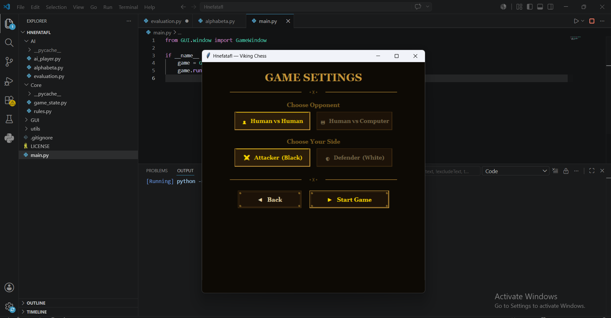
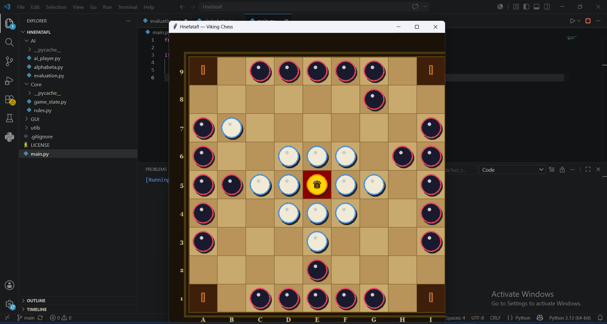

# AI Viking Chess ♟️

An Artificial Intelligence implementation of the Viking Chess (Hnefatafl) board game using Python.

The project features an intelligent opponent powered by the Minimax algorithm enhanced with Alpha-Beta Pruning, enabling efficient decision-making and strategic gameplay.

---

## 📖 Overview

Viking Chess (Hnefatafl) is a historic Scandinavian strategy game in which one side attempts to help the King escape while the opposing side tries to capture him.

This project recreates the game and introduces an AI player capable of evaluating board positions and selecting optimal moves through adversarial search techniques.

---

## 🚀 Features

- Complete Viking Chess game implementation
- Human vs AI gameplay
- Minimax Search Algorithm
- Alpha-Beta Pruning Optimization
- Heuristic Board Evaluation
- Object-Oriented Design
- Turn-Based Game Logic
- Efficient Move Generation

---

## 🧠 Artificial Intelligence

### Minimax Algorithm

The AI explores possible future game states and selects moves that maximize its chances of winning while minimizing the opponent's opportunities.

### Alpha-Beta Pruning

To improve performance, Alpha-Beta Pruning is applied to eliminate branches that cannot affect the final decision.

Benefits include:

- Faster decision making
- Reduced search space
- Improved game tree exploration
- Better overall performance

---

## 🖼️ Screenshots

### Gameplay Example

### AI Decision Making Example

---

## 🛠️ Technologies Used

- Python
- Object-Oriented Programming (OOP)
- Artificial Intelligence
- Minimax Algorithm
- Alpha-Beta Pruning
- Game Theory
- Search Algorithms

---

## 🎯 Learning Outcomes

This project strengthened my understanding of:

- Adversarial Search
- Game Tree Exploration
- AI Decision Making
- Algorithm Optimization
- Object-Oriented Design
- Problem Solving

---

## 🔮 Future Improvements

- Graphical User Interface (GUI)
- Multiple Difficulty Levels
- Improved Evaluation Heuristics
- Multiplayer Support
- Game Replay System

---

## 👨‍💻 Author

**Abdulrhman Tamer**

Computer Science Student interested in:

- Artificial Intelligence
- Algorithms & Data Structures
- Backend Development
- Software Engineering
